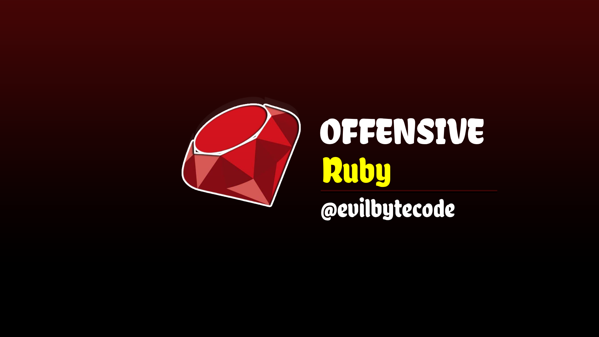

# RubyRedOps

    

---
RubyRedOps is a Ruby-based tool or project focusing on offensive security operations. This section provides an overview of its functionalities and use cases.

## Tools Currently Supported:
- **Callback Shellcode Execution**: Demonstrates the execution of shellcode via callback mechanisms.
- **Enabling All Privilege Tokens**: Activates all available privilege tokens to escalate or manipulate permissions.
- **Enumerating Processes with Ruby**: Uses Ruby scripts to discover and list active processes on the system.
- **Memory Mapping Injection**: Injects malicious code into local processes through memory mapping, aiming to exploit vulnerabilities.
- **Command Execution**: Executes arbitrary commands within the system using Ruby.
- **Ruby2Exe**: Use Orcan Package to convert Ruby to Executable
- **AntiAnalysis**: Anti Analysis Technique, Running Processes,Cpu Processors and RAM Check.
- **ApiHammering**: API Hammering consists of carrying out various actions to delay the malware.

## License
This project is licensed under the MIT License. See the LICENSE file for details.